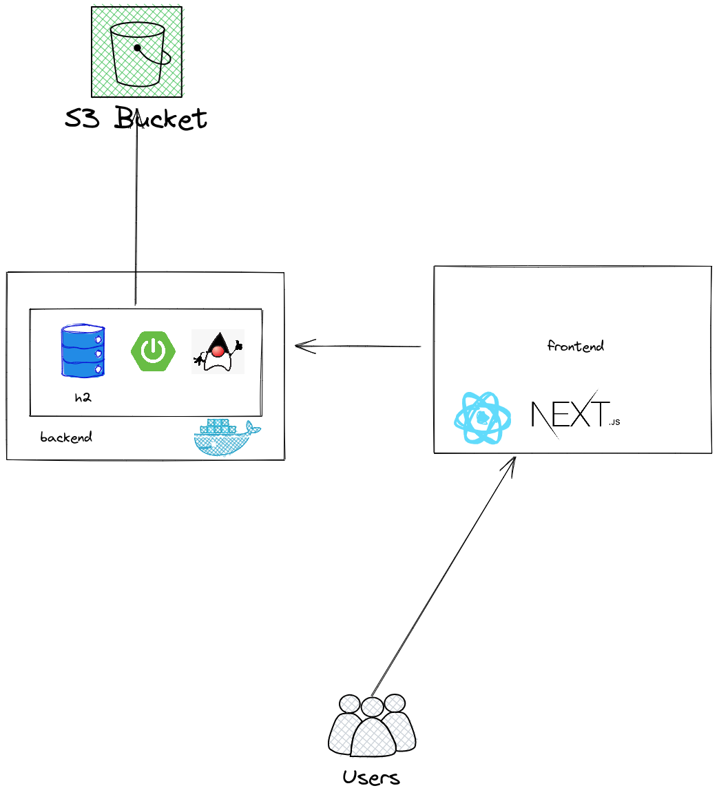

# free-programming-ebooks

The `free-programming-ebooks` is a web application that aims to allow the searching and download of free bookings on internet.

## Technologies:

Backend: Java 17 and SpringBoot

Frontend: NextJS

## Tutorials

- [Create S3 Bucket](./docs/tutorials/create-s3-bucket.md)

## Architecture

This is a simple architecture for study purpose!

